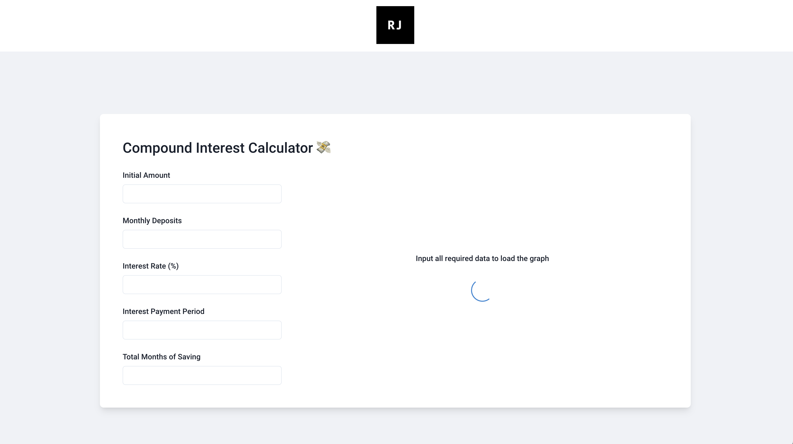

# Compound Interest Calculator - React & Node 💸
An application to calculate compound interest given various parameters. 
Built with:
- TypeScript
- React
- Node
- CharkaUI
- React Testing Library
- Jest

## Running the application

To run the app, `cd` into the project root directory and run `yarn install` & `yarn start`

To run the app in development mode with hot-reloading of client and server: `yarn dev`.

Depending on your environment, you might need to install concurrently / Typescript globally.

## Running the tests

-   Client and Server: `yarn test`
-   Client (watch mode): `yarn client:test`
-   Sever (one time run): `yarn server:test`
-   Sever (watch mode): `yarn server:test:watch`
